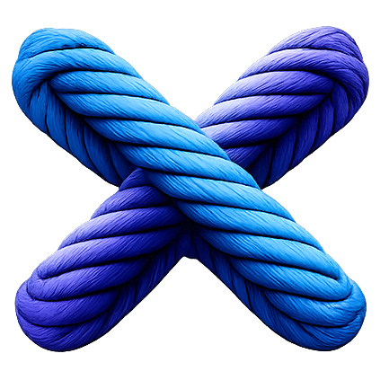
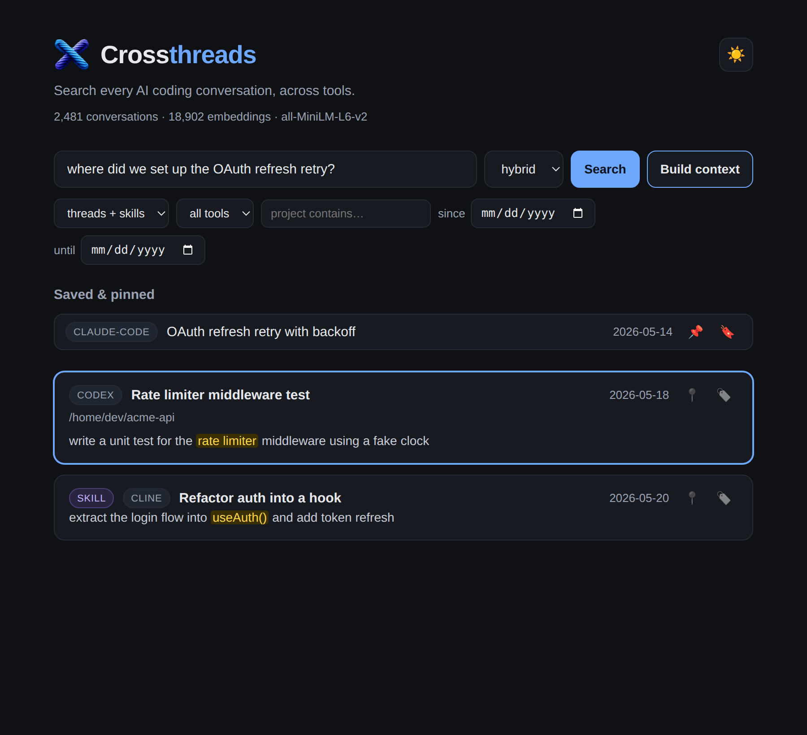
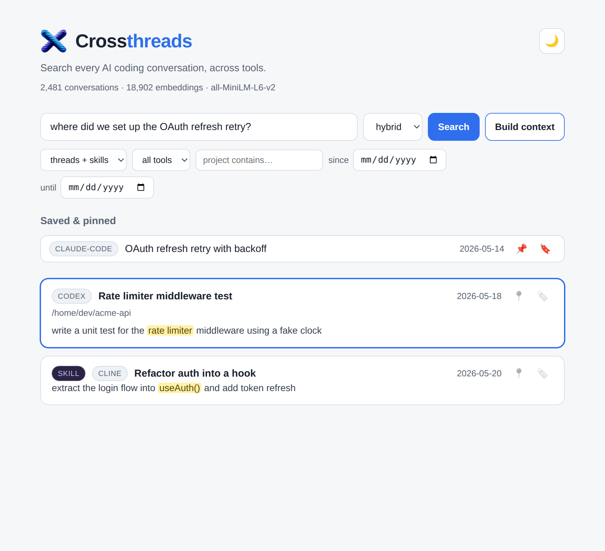

<div align="center">



# Crossthreads

**Search, recall, and resume every AI coding conversation — across all your tools and devices, in one place.**

[](https://github.com/Cam-Smith-One/Crossthreads/actions/workflows/ci.yml)
[](LICENSE)
[](#-principles)
[](#-how-it-works)
[](#-for-agents-mcp)
[](CONTRIBUTING.md)

⚠️ Early Beta: Under active development. Expect a lot of rough edges.

<br/>



</div>

---

Crossthreads is a **local-first session indexer and memory layer** for AI coding agents. It searches across **Claude Code, Codex, Cursor, Aider, Cline, GitHub Copilot Chat, Gemini CLI, Windsurf, and Antigravity** — auto-discovering each tool's conversation history wherever it lives, normalizing everything into one schema, and giving you **fast hybrid search** (keyword + semantic) over the whole corpus. Then it makes every result *actionable*: open the original, copy a resume command, or build a paste-ready context block for a fresh agent. A background daemon keeps the index live, and an MCP server lets your agents query it natively. And **cross-device search** lets one query span the history on your *other* machines too — federated over your own Tailscale network, with no central server.

> **Where's the thread where we fixed the OAuth refresh retry?** — one query, every tool, instant answer.

## Contents

- [Why](#-why) · [Quick start](#-quick-start) · [Features](#-features) · [Supported tools](#-supported-tools)
- [Search modes](#-search-modes) · [Screenshots](#-screenshots) · [For agents (MCP)](#-for-agents-mcp)
- [How it works](#-how-it-works) · [Privacy](#-privacy) · [Documentation](#-documentation) · [Roadmap](#-roadmap) · [Contributing](#-contributing)

## ⚡ Why

Every coding agent stores its own history in its own format — Claude Code JSONL here, Cursor SQLite there, Codex rollouts somewhere else — and each tool's built-in search is siloed and weak. When you switch tools daily, your most valuable context (how you solved something last week) becomes unsearchable.

Crossthreads indexes **all of it** into one place and answers cross-tool questions in milliseconds — locally, with no telemetry and no account.

## 🚀 Quick start

**Install — no toolchain required.** Grab a prebuilt build and open the app:

```sh
# macOS / Linux
curl -fsSL https://raw.githubusercontent.com/Cam-Smith-One/Crossthreads/main/scripts/install.sh | bash
crossthreads-up        # indexes your sessions, then opens http://127.0.0.1:47101
```

```powershell
# Windows (PowerShell)
irm https://raw.githubusercontent.com/Cam-Smith-One/Crossthreads/main/scripts/install.ps1 | iex
crossthreads-up
```

This installs to `~/.crossthreads` (`%USERPROFILE%\.crossthreads` on Windows), links the `crossthreads` / `crossthreadsd` / `ct-mcp` commands onto your PATH, indexes whatever tools you have, watches for new sessions, and opens the web app.

> Hit a snag? See [**Troubleshooting**](docs/TROUBLESHOOTING.md) — it covers the usual install/run/indexing gotchas.

<details>
<summary><b>Build from source</b> (Rust + Node)</summary>

```sh
# One command: build, index your real sessions, and open the app.
scripts/start.sh              # fast offline search
CT_ONNX=1 scripts/start.sh    # real semantic search (downloads all-MiniLM once)

# …or run the pieces directly:
cargo run --release -p ct-cli -- index
cargo run --release -p ct-cli -- search "oauth refresh retry" --mode hybrid
cd ui && npm install && npm run build && cd ..
cargo run --release --features onnx -p ct-daemon -- --http 127.0.0.1:47101 --ui ui/dist

# …or bring up a sample multi-tool corpus + UI:
CT_ONNX=1 scripts/demo.sh
```

> Prebuilt binaries use the deterministic offline embedder (instant, no network). Build with `--features onnx` for ONNX/all-MiniLM semantic search.

</details>

<details>
<summary><b>Search from the terminal</b></summary>

```sh
crossthreads search "where did we set up the websocket reconnect?" --mode hybrid
crossthreads context "oauth refresh retry" > prior-context.md   # paste-ready block
crossthreads status                                              # index health
crossthreads themes --k 8                                        # cluster your work into themes
crossthreads themes --name                                       # …and name them with your local model login
crossthreads insight open_loops                                  # unresolved work across recent sessions
crossthreads insight how_i_work                                  # your conventions, for a CLAUDE.md / AGENTS.md
crossthreads llm-auth                                            # which model credentials are available
```

</details>

## ✨ Features

| | |
|---|---|
| 🔎 **Hybrid search** | FTS5 keyword (BM25) **+** semantic embeddings fused with Reciprocal Rank Fusion — finds threads by meaning, not just keywords. |
| 🧩 **9 tools, one index** | Claude Code, Codex, Cursor, Aider, Cline, Copilot Chat, Gemini CLI, Windsurf, Antigravity — auto-detected, deduped by content hash. |
| 🖥️ **Cross-device search** | Search the history on your *other* machines too — federated over your private Tailscale tunnel, results tagged by device, local-first. [Set up →](docs/MULTI_DEVICE_SETUP.md) |
| 🗺️ **Theme map** | Clusters your sessions by topic so you can see what you've been working on across tools — in the web app (🗺️) and as `crossthreads themes`. Offline; "✨ Name with AI" labels clusters using your model login. |
| 💡 **Insights** | LLM synthesis over your whole history — **open loops**, a **decision log**, **knowledge cards**, a **how-I-work** profile, and a **digest** — spanning every tool *and* your skills/prompts (hundreds of records). In the web app (💡), the CLI (`crossthreads insight`), and over MCP. Opt-in; uses your model login. |
| 🤝 **Bring your own model (optional)** | Reuse your existing **Claude Code / Codex / Gemini** login — or paste an API key in Settings → Models (stored in the OS keychain) — to power insights and name themes. Off by default; the index never calls a model. |
| 🧠 **Skills & prompts too** | Searches reusable Claude `SKILL.md` and Codex prompts alongside conversations (`kind` filter). |
| 📌 **Bookmarks & pins** | Durable, kept in a separate store keyed by a stable session id — they survive re-indexing *and* a conversation growing. |
| 🔗 **Actionable results** | Open the original file in your file manager, copy a `claude --resume` / `codex resume` command, or build a context block to inject into a new agent. |
| 🤖 **Agent-native (MCP)** | Agents call `search` / `recall` / `build_context` / `status` over MCP — your history becomes their memory. |
| 🛰️ **Live & automatic** | A background daemon watches your tools' storage and re-indexes new sessions as they land. |
| 🌗 **Polished web UI** | Fast React UI with light/dark themes, filters, keyboard nav, and a full transcript viewer. |
| 🔒 **Local-first** | No telemetry, no account, nothing leaves your machine. One SQLite file you can back up or delete. |

## 🧩 Supported tools

These are the AI coding agents and assistants Crossthreads reads from. Each one
keeps its own conversation history in its own place and format — a `.jsonl` log
here, a SQLite `state.vscdb` there, Markdown somewhere else. Crossthreads has a
small **connector** per tool that:

1. **detects** whether the tool's data is present on your machine,
2. **reads it where it lives** (always **read-only** — open editors are fine),
3. **normalizes** every session into one common schema (tool, project, messages,
   timestamps), and
4. **deduplicates** by content hash into a single index.

So a single search spans *all* of them at once — no per-tool exporting, no
copy-paste. Add a tool to your workflow and its history shows up automatically on
the next index.

| Tool | What it is | Where Crossthreads reads it | Confidence |
|---|---|---|---|
| **Claude Code** | Anthropic's terminal coding agent | `~/.claude/projects/**/*.jsonl` | ✅ High |
| **Codex** | OpenAI's CLI coding agent | `~/.codex/sessions/**/rollout-*.jsonl` | ✅ High |
| **Cursor** | AI-first VS Code fork | `…/Cursor/User/**/state.vscdb` (composer + legacy chat) | ✅ High |
| **Aider** | Terminal pair-programmer | `**/.aider.chat.history.md` | ✅ High |
| **Cline** | Agentic VS Code extension | `…/<editor>/globalStorage/saoudrizwan.claude-dev/tasks/**` | ✅ High |
| **GitHub Copilot Chat** | Copilot's chat in VS Code | `…/<editor>/**/chatSessions/*.{json,jsonl}` | ✅ High |
| **Gemini CLI** | Google's terminal coding agent | `~/.gemini/tmp/*/chats/session-*.{json,jsonl}` | ✅ High |
| **Windsurf** | Codeium's agentic editor (Cascade) | `…/Windsurf/User/**/state.vscdb` | 🟡 Medium |
| **Antigravity** | Google's agentic IDE | Markdown artifacts under `~/.gemini/antigravity/` (best-effort)¹ | 🟠 Low |
| **Skills / prompts** | Reusable Claude `SKILL.md` + Codex prompts | `~/.claude/skills/**/SKILL.md`, `~/.codex/prompts/*.md` | ✅ High |

<sub>¹ Antigravity's full conversation lives in an undocumented protobuf format; Crossthreads scans the Antigravity home and indexes the readable Markdown task/plan artifacts (wherever they sit under it) until that format is documented. Connectors detect-and-skip gracefully and are stamped with a versioned fingerprint, so a format change degrades to "missed a session," never a crash.</sub>

## 🔎 Search modes

| Mode | What it does | Best for |
|---|---|---|
| `lexical` | FTS5 / BM25 keyword search | exact terms, identifiers, error strings |
| `semantic` | cosine over all-MiniLM embeddings (in-memory, normalized) | "the thread about login failing" → finds *OAuth 401* |
| `hybrid` *(default)* | Reciprocal Rank Fusion of both | the best of each — recommended |

All modes support **filters**: tool, `kind` (thread/skill), project substring, and a date range.

## 📸 Screenshots

<div align="center">


</div>

## 🤖 For agents (MCP)

Point any MCP client at the `ct-mcp` binary and your agent gets eleven tools:

| Tool | Purpose |
|---|---|
| `crossthreads_search` | hybrid/semantic/lexical search with filters |
| `crossthreads_recall` | answer-oriented digest of relevant past sessions for a question |
| `crossthreads_build_context` | render top matches into a paste-ready context block |
| `crossthreads_status` | index health and counts |
| `crossthreads_devices` | list the devices available to cross-device search |
| `crossthreads_themes` | cluster the user's sessions into themes (label, size, tool mix, samples; `name` for AI labels) |
| `crossthreads_open_loops` | unresolved work, dangling TODOs, and unconfirmed fixes |
| `crossthreads_knowledge_cards` | durable Q→A cards worth remembering |
| `crossthreads_decision_log` | notable decisions ("chose X over Y because Z") with rationale |
| `crossthreads_how_i_work` | the user's working conventions, for a CLAUDE.md / AGENTS.md |
| `crossthreads_digest` | a short reflective digest of recent work |

The last five synthesize with the user's model login; the rest work offline.

```jsonc
// e.g. in an MCP client config
{ "mcpServers": { "crossthreads": { "command": "ct-mcp" } } }
```

**Install the agent skill** so your tools proactively recall prior work (it
encodes "recall before you build, search when stuck"):

```sh
crossthreads skill install        # Claude Code skill + Codex /crossthreads prompt
```

`ct-mcp` **auto-starts `crossthreadsd`** on first use (and reuses one that's
already running — there's only ever one writer per index), so registering the
MCP server is the only step. Use the **absolute path** to `ct-mcp` so it can find
its sibling daemon. See [docs/AGENT_API.md](docs/AGENT_API.md) for the full
CLI/JSON, HTTP, and MCP contracts.

## 🏗️ How it works

```text
   AI coding tools                Crossthreads daemon                Surfaces
 ┌──────────────────┐          ┌───────────────────────┐        ┌──────────────┐
 │ Claude Code JSONL│          │  connectors → normalize│        │  Web UI       │
 │ Cursor  state.vscdb│  watch │  → SQLite index        │  RPC   │  CLI          │
 │ Codex rollouts   │ ───────► │  • FTS5 (BM25)         │ ─────► │  MCP server   │
 │ Cline / Copilot  │          │  • vectors (cosine)    │        │  (agents)     │
 │ Gemini / Windsurf│          │  • RRF hybrid + filters│        └──────────────┘
 │ Aider / Antigrav.│          │  • durable user_state  │
 └──────────────────┘          └───────────────────────┘
```

A single-writer daemon owns one SQLite database (conversations, an FTS5 index, vector embeddings, and a separate durable `user_state` table for bookmarks/pins). It serves search/status/context over a loopback socket **and** an HTTP bridge that also serves the web UI. The same daemon backs the CLI, the desktop shell, and the MCP server.

```text
crates/
  ct-core         normalized schema + Connector trait + content hashing
  ct-connectors   9 conversation connectors + skills/prompts (+ shared VS Code helpers)
  ct-embed        Embedder trait: deterministic hash (default) + ONNX/all-MiniLM (`onnx`)
  ct-store        one SQLite index: FTS5 + vectors + RRF hybrid + filters + user_state
  ct-index        indexing orchestration shared by CLI + daemon
  ct-daemon       crossthreadsd: single-writer daemon + loopback/HTTP API + file watcher
  ct-cli          crossthreads CLI (index / search / context / status)
  ct-mcp          MCP server: agents query your history natively
ui/               React + Vite frontend (web + Tauri), talks to the daemon
```

## 🔒 Privacy

- **Local-first, no telemetry.** Nothing leaves your machine; there's no account and no network call except the optional one-time model download for ONNX semantic search.
- **One file.** The entire index is a single SQLite database under your platform data dir — back it up, inspect it, or delete it anytime.
- **Rebuildable by design.** The index is a cache regenerated from your tools' own files; your bookmarks/pins live in a separate table so a rebuild never loses them.

## 📚 Documentation

| | |
|---|---|
| [DEVELOPMENT](docs/DEVELOPMENT.md) | Build, test, run the daemon/UI/MCP; the `onnx` feature; releasing |
| [TROUBLESHOOTING](docs/TROUBLESHOOTING.md) | Fixes for common install/run/indexing issues |
| [ARCHITECTURE](docs/ARCHITECTURE.md) | Components, data model, daemon process model, privacy posture |
| [AGENT_API](docs/AGENT_API.md) | CLI/JSON, MCP, and HTTP interface (search / recall / build_context) |
| [PRD](docs/PRD.md) · [REQUIREMENTS](docs/REQUIREMENTS.md) · [ROADMAP](docs/ROADMAP.md) | Product intent, requirements, status |
| [DECISIONS](docs/DECISIONS.md) | Architecture decision records (ADRs) |
| [CROSS_DEVICE_SEARCH](docs/CROSS_DEVICE_SEARCH.md) | Search your other machines, local-first (federation over Tailscale) |
| [MULTI_DEVICE_SETUP](docs/MULTI_DEVICE_SETUP.md) | Step-by-step: connect your devices for cross-device search |

```sh
scripts/check.sh   # everything CI runs: fmt + clippy + tests + UI build
scripts/demo.sh    # bring up the full stack against a sample corpus
```

## 🗺️ Roadmap

- ✅ Connectors for 9 tools + skills/prompts, hybrid search, daemon, web UI, MCP, durable bookmarks/pins, prebuilt releases, **cross-device search** (federation over Tailscale)
- ⏳ Native desktop app (Tauri shell scaffolded), richer resume/deeplinks, notes & tags on conversations
- 🔭 `sqlite-vec` ANN for very large corpora, offline cross-device access (index replication) + team sharing, community connector plugins

See [docs/ROADMAP.md](docs/ROADMAP.md) for the phased plan mapped to requirement IDs.

## 🤝 Contributing

Contributions welcome — see [CONTRIBUTING.md](CONTRIBUTING.md) and the [Code of Conduct](CODE_OF_CONDUCT.md). Adding a connector is a self-contained change: implement the `Connector` trait, register it in `builtin()`, and add a regression fixture. Security issues: please report privately per [SECURITY.md](SECURITY.md).

> **Status:** pre-release. The backend (connectors, search, daemon, MCP, web UI) is implemented and tested; the native desktop app is scaffolded. Not yet publicly announced.

## 🧭 Principles

1. **Local-first & private by default** — no telemetry; your data never leaves your machine unless you opt in.
2. **Better than grep** — hybrid lexical + semantic retrieval with natural-language queries.
3. **Actionable, not just searchable** — every result can be opened, resumed, or injected.
4. **Resilient connectors** — tool formats change; detection is versioned and degrades gracefully.
5. **Agent-friendly** — agents query Crossthreads over CLI/JSON and MCP.

## 📄 License

[Apache-2.0](LICENSE) © Crossthreads contributors.
